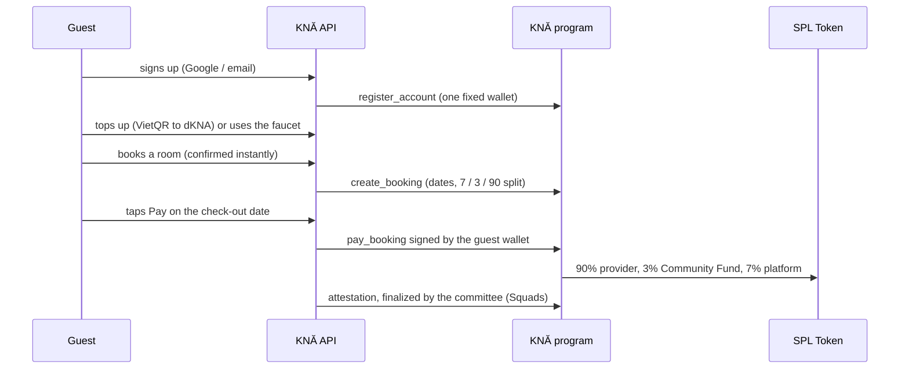

# Deploying KNĂ Track 2 on its own

`track2/full-package` is deployed as its own product, separate from `main`: its own Render services (`kna-t2-api`, `kna-t2-web`), its own Neon database, and the devnet program `2Ft67fV4…JK6f` upgraded in place. It is not merged into `main`.

Do the steps in order. Steps 1–3 need the keys in `secrets/`; nothing here is committed.

## 0. Keys you need locally

| File / variable | What it is | Used by |
|---|---|---|
| `secrets/deploy-keypair.json` | Upgrade authority and config authority (`FfNV…u6J`) | steps 1, 2 |
| `DEMO_MINT` | The dKNA mint (from `secrets/.env.demo-token`) | step 2, Render |
| `DEMO_FUNDER_KEYPAIR_B58` | dKNA mint authority: top-ups and the demo faucet | Render |
| `KNA_REGISTRAR_KEYPAIR_B58` | The platform's coordinator-role key: registers accounts, records bookings, pays network fees | step 2, Render |
| `WALLET_ENCRYPTION_KEY` | 32 random bytes (base64) that encrypt the platform-held wallet keys | Render |

The deploy wallet needs devnet SOL for the upgrade buffer (about twice the program size in rent, refunded afterwards), and the registrar needs devnet SOL for the fees and rent it pays. Check with the dry run below.

## 1. Build, test and upgrade the program

```powershell
.\scripts\program-tests.ps1          # anchor build + LiteSVM tests
.\scripts\upgrade-devnet.ps1 -DryRun  # checks authority, sizes, balance
.\scripts\upgrade-devnet.ps1          # extends if needed, then upgrades in place
```

The upgrade keeps the program ID, so existing config, roles and attestations stay valid. The new instructions only add accounts (`PaymentConfig`, `AccountRecord`, `WalletRecord`, `BookingRecord`); no existing account layout changed, and the existing error codes 6000–6007 keep their numbers.

## 2. Payment config and registrar (once)

From `app/apps/api`, with `DEMO_MINT` and `KNA_REGISTRAR_KEYPAIR_B58` in the environment:

```powershell
npx tsx src/scripts/setup-payments.ts
```

It is idempotent. It runs `initialize_payment_config` (dKNA, 1 VND = 1,000 base units, platform wallet 7%, Community Fund 3%) and grants the coordinator role to the registrar. Set `KNA_PLATFORM_WALLET` / `KNA_COMMUNITY_FUND_WALLET` first to override the defaults (deploy wallet / committee vault).

## 3. Render

1. Create a Neon project for Track 2. Copy its pooled and direct connection strings.
2. In Render: **New → Blueprint**, pick `diutnh26/kna`, branch `track2/full-package`. Render reads `render.yaml` at the repo root and proposes `kna-t2-api` and `kna-t2-web`.
3. Fill every `sync: false` variable in the dashboard: the database strings, a fresh `JWT_SECRET`, the dKNA keys, and the VietQR, SMTP and Google values.
4. Deploy. The API build runs `prisma migrate deploy` against the new database.
5. Make the first admin. Sign up on the web app, then run `npx tsx src/scripts/make-admin.ts you@example.com` from `app/apps/api`, with `DATABASE_URL` set to Neon's direct connection string. Later admins are made in the console. See [ADMIN.md](ADMIN.md).

Live hosts: `https://kna-t2-api-or0d.onrender.com` and `https://kna-t2-web-or0d.onrender.com` (Render added the `-or0d` suffix). If they ever change, update `CORS_ORIGIN`, `PUBLIC_BASE_URL`, `WALLET_LINK_DOMAIN` and `VITE_API_URL` to match.

`COOKIE_SAMESITE=none` is required on Render: the web and API are on two `*.onrender.com` hosts, which browsers treat as different sites, so `Lax` session cookies would be dropped. On a single custom domain, set it back to `lax`.

## How money moves (devnet)



The amounts and the provider's wallet come from the on-chain booking record, not from the API. A booking can be paid once, only from the check-out date, and only from the guest's paying wallet (their fixed wallet, or a Phantom wallet they linked).
