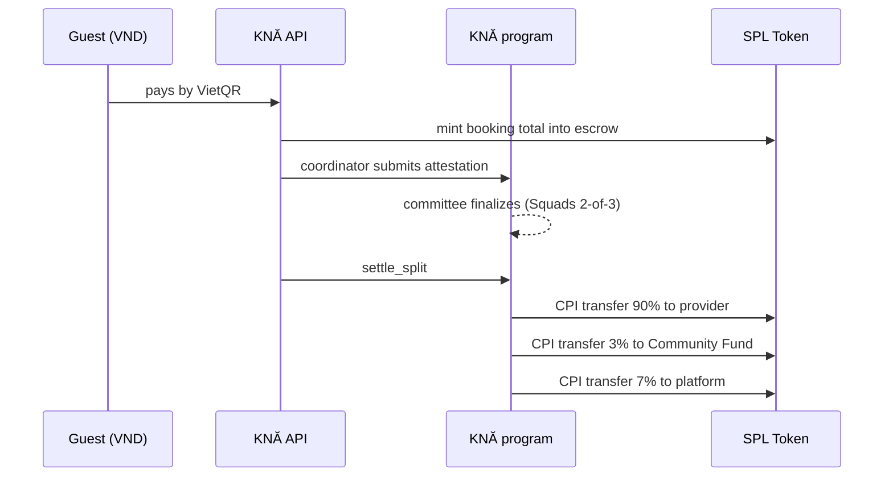

# Deploying KNĂ Track 2 on its own

`track2/full-package` is deployed as its own product, separate from `main`: its own Render services (`kna-t2-api`, `kna-t2-web`), its own Neon database, and the devnet program `2Ft67fV4…JK6f` upgraded in place. It is not merged into `main`.

Do the steps in order. Steps 1–3 need the keys in `secrets/`; nothing here is committed.

## 0. Keys you need locally

| File / variable | What it is | Used by |
|---|---|---|
| `secrets/deploy-keypair.json` | Upgrade authority and config authority (`FfNV…u6J`) | steps 1, 2 |
| `DEMO_MINT` | The dKNA mint (from `secrets/.env.demo-token`) | step 2, Render |
| `DEMO_FUNDER_KEYPAIR_B58` | dKNA mint authority; funds the escrow on payment | step 2, Render |
| `KNA_SETTLER_KEYPAIR_B58` | Optional. Signs `settle_split`; defaults to the funder key | step 2, Render |

The deploy wallet needs devnet SOL for the upgrade buffer (about twice the program size in rent, refunded afterwards). Check with the dry run below.

## 1. Build, test and upgrade the program

```powershell
.\scripts\program-tests.ps1          # anchor build + 37 LiteSVM tests
.\scripts\upgrade-devnet.ps1 -DryRun  # checks authority, sizes, balance
.\scripts\upgrade-devnet.ps1          # extends if needed, then upgrades in place
```

The upgrade keeps the program ID, so existing config, roles and attestations stay valid. `settle_split` only adds new accounts (`Treasury`, `SettlementRecord`); no existing account layout changed, and the existing error codes 6000–6007 keep their numbers.

## 2. Set up the treasury (once)

From `app/apps/api`, with `DEMO_MINT` and `DEMO_FUNDER_KEYPAIR_B58` (or `KNA_SETTLER_KEYPAIR_B58`) in the environment:

```powershell
npx tsx src/scripts/setup-treasury.ts
```

It is idempotent. It creates the escrow token account (the dKNA account owned by the treasury PDA), runs `initialize_treasury` (1 VND = 1,000 dKNA base units) and grants the coordinator role to the settler key. Set `KNA_PLATFORM_WALLET` first if platform fees should not go to the deploy wallet.

## 3. Render

1. Create a Neon project for Track 2. Copy its pooled and direct connection strings.
2. In Render: **New → Blueprint**, pick `diutnh26/kna`, branch `track2/full-package`. Render reads `render.yaml` at the repo root and proposes `kna-t2-api` and `kna-t2-web`.
3. Fill every `sync: false` variable in the dashboard: the database strings, a fresh `JWT_SECRET`, the dKNA keys, and the VietQR, SMTP and Google values.
4. Deploy. The API build runs `prisma migrate deploy` against the new database.

If the services get different hostnames, update `CORS_ORIGIN`, `PUBLIC_BASE_URL`, `WALLET_LINK_DOMAIN` and `VITE_API_URL` to match.

`COOKIE_SAMESITE=none` is required on Render: the web and API are on two `*.onrender.com` hosts, which browsers treat as different sites, so `Lax` session cookies would be dropped. On a single custom domain, set it back to `lax`.

## How money moves (devnet)



The payout amounts come from the finalized attestation, not from the API. A `SettlementRecord` per ledger entry prevents a second payout. If the automatic payout after finalize fails, for example because the provider has no linked wallet, a coordinator can retry it with `POST /chain/ledger/:id/settle`.
